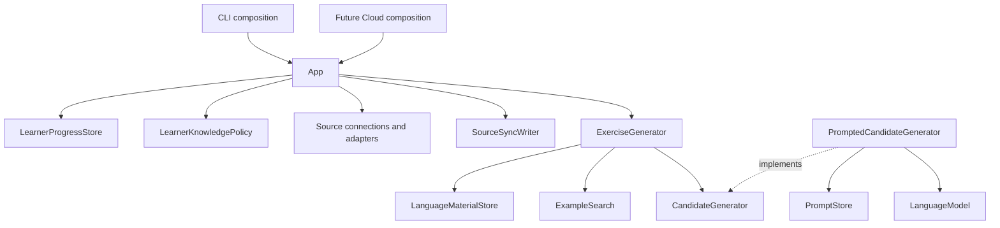

# Yomibu architecture

Accepted direction as of 2026-10-03. `SPEC.md` defines product requirements and
invariants; this document defines responsibilities, composition, and code
boundaries; `PLAN.md` records delivery and verification. Future examples here
describe intended contracts, not implemented features or authorization to build
every adapter.

## Delivery boundary

The completed migration covers the existing WaniKani `sync` and offline `status`
use cases, an application entry point, and interchangeable file and in-memory
stores. Offline preparation adds explicit grammar-file input, on-demand knowledge
policy, and cached lexical retrieval. G1 adds one explicit experimental provider
request and independent bounded assessment; G2 adds focused offline selection
and optional request preview, described below. Validated generation, grammar database persistence,
multi-source learner management, PostgreSQL, Cloud HTTP endpoints, and additional
provider integrations follow later.
Keep one Cargo package with a library and a thin CLI binary.

The completed **G0 — Manual candidate preview** slice in `PLAN.md` adds
explicit in-memory word/grammar input, deterministic selection, independent
result checks, and a CLI entry point. Its synchronous library operation has no
store, account, runtime, or service dependency. The existing storage/source
contracts are unchanged; the future generation pipeline remains deferred.

Do not replace the existing safety behavior during migration: source-state
preservation, full-refresh replacement, account protection, writer exclusion,
schema-1 compatibility, credential isolation, and distinct pre-replacement and
uncertain-durability errors remain required.

## Domain and vocabulary

Use the responsibility definitions in [SPEC.md](SPEC.md#design-vocabulary-and-composition).
The central distinctions are:

- **Language material:** what a character, word, or grammar entry means, including
  readings, descriptions, examples, identifiers, and provenance.
- **Learner progress:** source observations and manual declarations about a
  learner. Retain source state rather than a permanent `known` flag.
- **Learner knowledge:** the result of applying `LearnerKnowledgePolicy` to the
  selected progress. It is derived, explainable, and recomputable.
- **Source connection:** one learner's specific provider account or input. A
  provider kind is not a connection ID, and a provider account ID is not the
  future Yomibu learner ID.
- **Prompt template:** stored reusable instructions. **Model request:** prepared
  input for one invocation, including the selected exercise data and options.

Grammar entries keep provider-scoped IDs. Bunpro and Renshuu entries are not
automatically declared equivalent. Manual declarations receive technical IDs;
the learner supplies a description, not an ontology identifier. Never infer a
global count of unique grammar rules from unrelated provider records.

Application settings, learner data/source selections, and exercise requests are
separate inputs. Do not reintroduce an all-purpose `ProfileConfiguration`.

## Responsibilities and dependency direction



This diagram is the target responsibility model. The current sync/status slice
uses a physical `LearningStore` with a consistent read and an exclusive
`SourceSyncWriter`; it does not pretend that a WaniKani batch is generic learner
knowledge. Its `LearningSource` supplies normalized `WaniKaniSyncData` for this
slice. Generalize that source contract when a second real integration requires
it; do not erase provider semantics preemptively.

`FileLearningStore` and `InMemoryLearningStore` are physical backends. Their
current coherent read serves offline source summaries and preparation. Later
material/progress read ports can share the same backend and transaction boundary. This is not a
third repository of snapshots: `WaniKaniSyncData` is the transfer value containing
related material and progress from one synchronization interval.

Adapters implement small capabilities owned by the library. `App` depends on
those contracts, not HTTP or filesystem details. Domain validation is synchronous
and independent of adapters. No dependency-injection container, service locator,
per-field service objects, or mutable current-user singleton is needed.

Public extension points are justified by actual substitution needs. Use concrete
values/functions for deterministic logic. Code may be public without making all
its Rust implementation details `pub`. A trait does not require dynamic dispatch;
choose generics or trait objects according to actual composition needs.

## Execution and ownership

The executable owns argument parsing, settings, secret resolution, runtime
startup, output, and exit status. Library code does not read process environment,
start a runtime, or print. Constructors compose/configure; explicit methods open
resources and execute work.

For the current CLI:

1. Parse the command. Resolve a data directory for sync/status/prepare; only `sync`
   resolves the WaniKani token. Preview parses structured entries and directly
   calls the synchronous library operation described below. Analyze uses only
   its explicit input/dictionary paths and the synchronous composition below.
2. For sync/status, construct `FileLearningStore` for that directory and `App`.
   For `sync`, supply the WaniKani client as the source. `status` needs no source
   or HTTP client.
3. `App.sync` acquires a store writer before network retrieval. A corrupt cache
   or conflicting writer fails before fetching. The writer lives across fetch
   and replacement and is released on success, error, or future cancellation.
4. The source retrieves and normalizes the complete selected account state.
   Validation and summary preparation occur before commit.
5. The writer publishes material and progress together. The result identifies
   in-memory retention versus acknowledged durable persistence.
6. `App.status` loads a coherent data version and computes an owned summary. It
   never fetches, resolves secrets, or writes. The CLI renders the result.
7. `prepare` reads one version through `LearningStore::load` and its explicit
   grammar file, calls `prepare_context`, then renders the complete result.
   It constructs no source/runtime, holds no writer, and saves no classification.

One current store instance/directory is an explicit account scope. It must not
switch to a different account after its first successful write. This is not yet
a Cloud tenancy model. A future Cloud request authenticates and authorizes its
learner/connection before calling the library; do not infer authorization from
an arbitrary caller-supplied learner ID.

For generation, extend the flow explicitly:

```text
request -> settings and secrets -> dependencies -> optional explicit sync
        -> selected learner progress -> LearnerKnowledgePolicy
        -> language material and examples -> candidates -> validation
        -> accepted result or typed failure
```

`App` can accept all principal dependencies and construct `ExerciseGenerator`
internally. A convenience builder selects a documented default composition;
advanced users can compose the same dependencies directly. The standalone
generator accepts already prepared knowledge and does not require persistence.
Generation neither implicitly synchronizes nor changes learner progress.

Shared clients/pools/stores live as long as the application. A request owns its
learner selection, immutable inputs, budget, and result. Read a coherent input
version and pin prompt-set identity/version for each generation; release database
transactions before awaiting the model. New source data affects later requests.

## Generation structure and extension boundaries

The following is the target responsibility model, not G0's implementation list:

```text
LearnerKnowledge + GenerationRequest
                -> GenerationPlan
                -> CandidateGenerator
                -> Candidate[]
                -> Analysis + required checks
                -> Combined review when required
                -> Selection
                     -> accepted exercise
                     -> bounded repair -> NEW candidate -> full reassessment
```

Keep `LearnerKnowledge` and `LearnerKnowledgePolicy`; the discussion's
`KnowledgeProfile` and `KnowledgeProfileBuilder` do not introduce parallel
responsibilities. Knowledge about a vocabulary use keeps its written form,
reading, and meaning associated. A provider grammar entry and a recognizer that
can detect it are different facts; unsupported recognition is explicit and does
not imply equivalence across providers.

The logical text and analysis structures are:

```text
Candidate (immutable identity, content, generator provenance)
  GeneratedText
    Sentence -> text
    Story -> optional title + Paragraph[] -> Sentence[] -> text

TextAnalysis (candidate identity, analyzer/dictionary versions)
  ParagraphAnalysis[]
    SentenceAnalysis[]
      tokens + morphology + proposed readings
      grammar matches + complexity measurements
```

These diagrams need not become one public Rust struct per line. Choose enums
where distinct content variants require distinct payloads; introduce dialogue
or poetry variants only with an actual supported use case. Fragments may refer
to ranges in one immutable text representation. Tokens are analysis products,
not authoritative content supplied by a generator. Sentence segmentation and
other derived boundaries must also be attributed to their producer, not treated
as independent linguistic evidence merely because they have a type.

Generate a story as a coherent whole. Apply checks at their meaningful scopes,
including multi-token expressions and whole-story coherence. Titles also need
the applicable learner constraints. Findings carry a candidate reference and an
unambiguous location; token indices additionally identify the relevant analysis.
Document whether ranges use UTF-8 bytes or another unit. Editing creates a new
candidate (optionally linked to its parent), followed initially by full analysis
and assessment. Incremental invalidation is deferred.

Separate execution from judgment. A completed check has pass/fail/inconclusive
and findings; an execution failure remains a typed error, and a skipped check is
reported as not run. Required outcomes gate acceptance; quality measurements
rank eligible candidates. Keep weights and thresholds in explicit selection
configuration. Do not invent calibrated confidence from an arbitrary LLM score.
Measure false acceptance/rejection, unresolved cases, success before repair,
cost/latency, and learner-reported reading friction when evaluating real text.

Group components by concern while using small contracts for roles. For example,
a vocabulary component may contribute generation restrictions, check a candidate,
and propose repair information. An analyzer or candidate generator may implement
only its own role. Ordinary functions suffice for fixed deterministic behavior;
traits need a demonstrated substitution. Avoid a global context/service locator,
optional-hook mega-trait, execution DAG, or plugin manifests.

Trusted extension logic returns typed task contributions or uses explicitly
provided capabilities. The orchestration owns phase execution and the shared
model budget; no independent model calls hide in validators or retries. Prompt
composition consumes typed inputs plus replaceable prompt content and decodes
validated response shapes. This does not require a heterogeneous task registry
or arbitrary schema-merging framework. Role-specific contracts and their exact
Rust ownership/dispatch choices are verified in the implementing slice.

### Implemented minimal adaptation for G0

```text
CLI argument parsing -> structured word/grammar inputs + requested count
                    -> synchronous library preview
                    -> deterministic selection -> independent checks -> report
```

`src/preview.rs` exposes `preview(words, grammar, take)` with concrete
`WordEntry` inputs, a borrowed `Preview` result, `PreviewChecks`, `CheckOutcome`,
and typed `PreviewError`. Private functions validate all supplied inputs and
check the produced selection. Borrowed slices retain order, duplicates, and
associations without copying strings. A temporary `HashSet<&WordEntry>` checks
complete-entry membership with expected O(n + k) entry operations for n supplied
and k selected entries, plus string hashing cost and O(n) auxiliary storage.
`Hash` and equality are derived over all three fields. The set serves lookup
only; the original slice supplies ordered output with duplicates intact.
An independent length check compares the result with the requested count.
Grammar and linguistic correctness are explicitly unassessed.

CLI delimiter parsing and rendering stay in the executable. Rendering applies
`str::escape_debug` to word fields and grammar descriptions, keeping declarations
on one line and control sequences visible without mutating the library inputs.
A private data-dir resolver serves sync/status/prepare, but not preview.
Transient preview input never passes through `LearningStore`, `WaniKaniSyncData`, an account-scoped `App`, or a
knowledge policy. There is no generator/checker substitution need in this slice:
unit tests exercise the actual private checker with deliberately invalid data.
No trait, future text type, registry, or fake backend was added. Existing
sync/status behavior, cache schema, adapter layout, and package boundary remain.

## Implemented offline preparation slice

Its explicit flow is:

```text
CLI -> one LearningStore read + explicit grammar-file read
    -> synchronous prepare_context(source, grammar, policy, targets)
    -> knowledge derivation + structured lexical retrieval -> explanatory report
```

The standalone operation borrows the already-loaded WaniKani version and manual
grammar declarations. The selected concrete `LearnerKnowledgePolicy` derives
knowledge without fetching, saving, reading the environment, or consulting the
clock. The result preserves policy and source evidence, target associations,
grammar assertions, and unassessed linguistic limits. Source-subject eligibility
must not be represented as proof of every reading/sense combination.
The CLI renders the retained content, assignment, and review-statistic evidence
beside each decision, including absences, without reimplementing policy rules.

Grammar declarations belong to learner data; their separate versioned JSON input
does not change WaniKani schema 1. One-based declaration IDs are scoped to the
loaded input, not a cross-edit or cross-provider ontology. File loading is an
explicit adapter operation, while derivation and retrieval remain synchronous
deterministic library logic.

The existing `LearningStore` provides the demonstrated file/memory substitution.
One lexical source and concrete policy alternatives do not justify a new trait.
Do not retrofit G0, add a material-store hierarchy, or introduce a registry.
Retrieval uses associated source fields without claiming linguistic validation;
source examples are not automatically safe practice passages.

`grammar.rs` owns validated manual declarations. `knowledge.rs` owns concrete
policy choices and borrowed `LearnerKnowledge` evidence. `preparation.rs` exposes
`PracticeTarget`, `PreparedContext`, retrieved target evidence, typed errors, and
explicit unassessed aspects. It indexes available vocabulary by exact word, then
matches accepted reading/gloss fields without synthesizing combinations. Multiple
matches are errors before eligibility is considered. Input order and duplicates
survive selection; source examples remain ordered and unfiltered. Private helpers
validate target fields and match one source record. There is no new storage port,
policy trait, generator, or checker abstraction.

## A1 evaluation boundary (complete; no-go)

A1 is a synchronous, concrete library slice alongside preparation and G0:

- `analysis.rs` owns the bounded borrowed sentence and morphological evidence
  shapes. Whole units and components retain original UTF-8 byte spans.
- `adapters/sudachi.rs` explicitly loads exact verified dictionary bytes and uses
  `adapters/sudachi.json` as embedded configuration. No ambient config, user/dynamic
  plugins, normalization, fallback tokenizer, or implicit download. Owned bytes
  avoid checksum/mmap file races; real adapter tests remain mandatory.
- `evaluation.rs` validates input structure and applies exact synthetic vocabulary
  tuples plus seven explicit grammar bindings. It preserves arbitrary declaration
  content and IDs. Five checks report Pass/Fail/Inconclusive; typed input/execution
  errors remain outside those judgments, and NotRun is a distinct state.
- `examples/a1.rs` composes the real adapter and evaluator with explicit synthetic
  JSON and renders reports/exit codes. No general analysis CLI, learner-store
  integration, async runtime, review framework, or model/provider access is added.
- `scripts/setup_a1_dictionary.py` is explicit development/CI setup, outside runtime
  composition. It verifies the publisher ZIP and all three bundle files, retains
  complete bundles under ignored target storage, and publishes a `current` symlink
  atomically after synchronizing the bundle. Post-publication directory-sync errors
  report uncertain durability. Cache reuse verifies a single resolved bundle;
  legacy flat files and earlier bundles remain untouched. Offline Python boundary
  tests exercise setup; Rust tests still require the real pinned adapter at
  `target/a1/current/system_core.dic` and never silently skip or substitute it.

The [binding sheet](docs/A1_BLIND_PACKET_HEADER.md) defines two bounded patterns
and their exact limitations. Components cannot authorize a whole word. Object-use
metadata remains associated with a lexical identity and needs external source
evidence. Dictionary hypotheses and model opinions are not contextual truth.
Every evaluation exposes naturalness, MWE, and reading/sense limitations; a
structural Pass is never an accepted exercise.
Scope is an independent structural coverage/applicability check, not a copy of
permission outcomes; the [reference clarification](docs/A1_SCOPE_CLARIFICATION.md)
records that boundary without changing runtime composition.

Reference review remains a manual evidence process outside runtime. The
[protocol](docs/A1_REFERENCE_PROTOCOL.md), [packet](docs/A1_REVIEW_PACKET.md), and
[external prompt](docs/A1_EXTERNAL_REVIEW_PROMPT.md) keep source coverage,
provisional judgments, analyzer performance, and run integrity separate. The
visible synthetic set has provisional source-backed references and has been
evaluated after the separate custodian's holdout reference freeze. Its challenge
safeguard failed; the [evaluation record](docs/A1_EVALUATION_STATUS.md) keeps that
finding separate from held-out core accuracy. The implementation was frozen
before input release and used unchanged for one offline held-out run; complete
output is preserved. The separate private scoring receipt reports all held-out
core targets met, with one exact-span discrepancy retained. The failed challenge
safeguard makes the completed investigation a no-go; this does not add generation
or acceptance logic to runtime. Neither blind reference labels nor private learner
material belong in analyzer composition, Git, or this implementer's early context.
Versioned public synthetic drafts contain only runtime inputs. Private revision
logs preserve exclusions, family lineage, references and disagreements; changing
a draft does not change the analyzer or erase exposure for holdout separation.
G0, preparation, source/store boundaries, sync/status, and schema 1 are preserved.

The separate [post-A1 safeguard](docs/A1_FOLLOWUP.md) changes only the concrete
evaluator's treatment of recognized object/predicate combinations. It borrows the
object noun and particle to retain the combination's original span. Transitive
word evidence still cannot assess a multiword use, so Particles and Scope retain
uncertainty, combined with any existing permission failures. Other bounded checks
remain visible. This restriction also affects ordinary object sentences; there
is no phrase list, semantic adapter, new input format, or acceptance path. The
checkpoint and subsequent commits distinguish this code from the scored A1 run.

## Offline analyze command — separate post-A1 milestone

```text
CLI arguments -> bounded explicit JSON read -> Sentence + GrammarDeclarations
              -> pinned SudachiAnalyzer -> evaluation::evaluate
              -> escaped text or versioned JSON -> execution exit status
```

`src/analyze.rs` is a private module of the binary, not a library adapter or a new
domain service. It owns the small version-1 input envelope, 64 KiB bounded file
read, report envelope, and rendering. It reuses `EvaluationBindings` directly;
the library remains the sole authority on bindings and linguistic judgments.
Reports borrow the input and retain the original analysis/evaluation values.
Text includes every check and finding with quoted original byte-span excerpts;
JSON serializes the complete evidence and limitations without interpreting it.
Text and diagnostics use Rust display escaping. JSON keeps Serde's encoding and
additionally escapes DEL and nonprinting Unicode as JSON UTF-16 escapes, retaining
the original decoded strings. At the binary boundary, argument errors escape
Clap's invalid argument/value/subcommand contexts before formatting, preserving
diagnostic line breaks and indentation. The fixed `yomibu` binary name prevents
untrusted executable names from entering usage/help. Help/version keep normal
stdout presentation and successful exit status.
Errors propagate outside completed judgments, and no evaluation is printed when
input, dictionary initialization, analysis, or evaluation fails.

The branch in `main.rs` resolves no environment, store, source or runtime. The
explicit dictionary load remains the existing adapter's owned, checksum-pinned
operation. There is no implicit setup or file discovery. The research harness
`examples/a1.rs` and its frozen packet contract stay separate and unchanged.
This CLI does not revise A1's historical no-go or the later object-combination
restriction. Real-adapter subprocess tests compare CLI output to direct library
evaluation and check errors, spans, escaping and absence of writes.

## G1 experimental candidate composition

```text
CLI opt-in + explicit paths -> bounded input + existing binding validation
                           -> pinned dictionary -> explicit credential/client/runtime
                           -> one OpenAI POST -> immutable pair and provenance
                           -> independent synchronous Sudachi/evaluate per candidate
                           -> both results or separate execution errors -> report/exit
```

`adapters::openai::Client` is the single concrete provider adapter. Private DTOs
enforce completed Responses envelopes and the strict two-string payload. It sends
one versioned compiled prompt and explicit data with fixed model/schema/settings;
limits, sanitized typed errors, response parsing and request provenance stay here.
There is no SDK, generic model trait, prompt store, retry loop or persistence.
`Client::new` uses the official endpoint; `with_base_url` accepts that exact base
or numeric loopback HTTP without URL credentials/query/fragment for adapter tests.
The production executable offers no endpoint flag or environment override.

`generation::GeneratedCandidates` owns `[String; 2]` and provenance, borrowing the
original immutable `GrammarDeclarations`/`EvaluationBindings`. Its synchronous
`assess(&SudachiAnalyzer)` returns two `CandidateAssessment` values that borrow
the original texts. Completed values retain analysis and evaluation; typed errors
retain available analysis without inventing completed checks. A boxed Evaluation
keeps the enum compact; it does not introduce a new assessment abstraction.
No analyzer trait, self-referential result, accepted-exercise type or learner store
is needed. `EvaluationBindings::validate` exposes the same validation for preflight;
`evaluate` still validates analysis first, then bindings, preserving error precedence.

The binary's `generate.rs` owns the input/report DTOs, credential lookup and runtime
startup. `cli_support.rs` shares bounded file reads, check rendering and safe JSON
encoding with `analyze.rs`. The latter retains its output and fully offline flow.
Only the binary maps errors to exit codes. Reports borrow completed evidence and
keep execution errors separate from Fail/Inconclusive; all untrusted presentation
fields are escaped before composing readable output.

The same CLI entry takes a lazy, non-null concrete OpenAI client constructor.
Production supplies `Client::new`; the binary's test subprocess helper supplies a
loopback constructor explicitly. The helper and its environment variables exist
only under `cfg(test)`; no alternate production mode or fake tokenizer ships.
Tests run the real provider adapter, real pinned Sudachi and evaluator, with
synthetic keys and isolated HTTP servers/directories. Typed downstream-error
report tests are labelled boundary tests, not induced real-analyzer failures.

G1 never selects accepted exercises. A1's historical no-go, 24/24 outcomes,
120/120 judgments, 11/12 exact negative matches, frozen records and object safeguard
remain unchanged. The later validated-generation architecture elsewhere in this
document remains deferred. See [SPEC](SPEC.md#g1--experimental-single-sentence-candidates)
for contracts and [G1 usage](docs/G1.md) for privacy, spending and the separate smoke.

## G2 focused context composition

The [G2 contract](docs/G2.md) keeps source progress, full evaluator permissions,
lexical focus and selected generation context separate. Comfortable reading and
comprehension are later learner-feedback goals; a REPL is not this delivery.
`App`, stores, source adapters, knowledge policy and preparation are unchanged.

`generation_context::select_context` synchronously validates full inventory bounds
and bindings, resolves a checked one-based `VocabularyEntryId`, examines the three
private compiled situations, explains every decision and independently validates
produced membership/focus/slots/order/size. `GenerationContext<'a>` holds selected
references and borrows immutable original permissions/declarations. Conflicting
same-spelling tuples never resolve through entry number or situation priority.

`openai::prepare_focused_request` performs no I/O: it consumes that context and
owns one bounded serialized body and hash in `FocusedRequest<'a>`, retaining full
borrowed evaluation inputs. `Client::generate_focused_candidates` sends precisely
those bytes through the same G1 transport/parser, adding local selection provenance.
`GeneratedCandidates::assess` is unchanged and evaluates both original texts with
real pinned Sudachi and the complete input permissions. Separate functions in
`generation` observe focus occurrence and whole-unit context membership; no new
evaluator check or acceptance gate exists. Only the existing reading/stem helpers
become crate-visible; judgments, spans and object safeguards are unchanged.

The binary-private `focused` module owns bounded file reads, input storage,
credential lookup, runtime, preflight order and rendering for `context-preview`
and `generate-focused`. Preview reaches no dictionary, credential or client.
Generation has no import, retained session or interactive confirmation and ignores
`--data-dir`. Shared rendering preserves G1 reporting; a parameterized read helper
keeps the older 64 KiB boundaries. No new dependency, trait, catalogue loader,
ranking/retrieval framework, automatic data bridge or source access is introduced.

Frozen A1 records remain untouched: no-go, 24/24 outcomes, 120/120 judgments,
11/12 exact negative reason/span matches. Observed morphological focus does not
validate contextual reading/sense. Intended-use grounding and all later validated
practice requirements remain deferred, including ambiguous accepted targets.

## Stores, source data, and consistency

| Backend | Retention and failures | Verification |
| --- | --- | --- |
| In memory | Lives with its explicit store handle; no crash durability; full replacement and account validation still apply | Real state transitions, failed writes, reader/writer isolation |
| Local file | Complete replacement under an advisory lock; failures before replacement preserve the old cache; directory-sync failure means replacement happened but durability is uncertain | Actual temporary files, interruption and filesystem faults |
| Future SQL | Transactional material/progress publication scoped to learner/connection; database errors and commit uncertainty remain explicit | Isolated real database, transactions and concurrency |
| Future API | Latency, authentication, availability, write support, and consistency depend on the service contract | Real HTTP adapter against a local controlled endpoint |

Do not imply that an in-memory backend verifies file durability or SQL behavior.
Do not silently substitute memory storage after a persistent-store failure.
The current cache remains `wanikani.json` with the schema-1 `snapshot` key; the
Rust type name does not determine its wire format.

Multiple future connections can provide the same material category. Preserve
connection-level progress provenance. Refreshing one connection replaces only
its own data, preserving other connections and manual declarations. Report each
connection's outcome and data age; partial success is not an all-source success.

Separate updates from derived views. `LearnerKnowledge` starts as an on-demand
calculation. A materialized view, if later justified, carries input revisions
and policy version. CQRS does not require event sourcing, a command bus, or a
second database. Generating an exercise is a costly operation even without a
database write; fetching an existing result is a different operation.

## Generation composition examples (future Ruby pseudocode)

One-off use does not need a learner store:

```ruby
knowledge = LearnerKnowledgePolicy.default.derive(progress)
candidates = PromptedCandidateGenerator.new(model: model, prompts: prompts)
generator = ExerciseGenerator.new(
  materials: InMemoryLanguageMaterialStore.new(materials),
  examples: InMemoryExampleSearch.new(examples),
  candidates: candidates
)
result = generator.generate(knowledge, request, budget)
```

Cloud uses public adapter code with private runtime data:

```ruby
store = PostgresLearningStore.new(pool)
prompts = FilePromptStore.new(directory: private_prompt_directory)
candidates = PromptedCandidateGenerator.new(model: model, prompts: prompts)

app = Yomibu::App.new(
  materials: store.materials,
  progress: store.progress,
  sync_writer: store.sync_writer,
  sources: authorized_sources,
  examples: PostgresExampleSearch.new(corpus_pool),
  knowledge_policy: LearnerKnowledgePolicy.default,
  candidates: candidates
)
report = app.sync(authorized_learner) if refresh_requested
result = app.generate(authorized_learner, request, budget)
```

These are composition sketches, not frozen Ruby-like constructor requirements
for Rust. In-memory data does not imply an offline model. Replacing the model or
the corpus adapter must not change generation logic. A thin Cloud client calls
the remote Yomibu use-case API; it does not masquerade as a `LanguageModel`.

## Scenario checks and implementation timing

| Scenario | Composition change | Shared behavior and timing |
| --- | --- | --- |
| Local CLI, remote model | Local data/prompt stores plus a remote `LanguageModel` | Knowledge derivation, context preparation, validation, and budgets remain the same; implement with the first generation slice |
| Local CLI, local model | Replace only the model adapter, with an explicit capability/structured-output contract | Same generation flow; implement a local adapter only when a specific runtime is selected, without pretending all models have identical capabilities |
| Local algorithm, remote corpus | Replace `ExampleSearch` or the needed material read capability with an HTTP adapter | Selection and validation remain local; network failures and deadlines remain explicit; remote corpus is deferred |
| Thin remote Yomibu client | Use a Yomibu use-case client calling the Cloud API | The server owns generation dependencies; this is an alternative execution boundary, not a model swap; remote protocol is deferred |
| One-off in-memory generation | Pass progress/derived knowledge and material values directly; use memory adapters only for required lookup contracts | Same standalone generator without persistence, learner registration, or synchronization; cover with the first generation slice |
| Several sources of one category | Explicit connection IDs and selected progress for each learner; share provider clients where safe | One connection's refresh never overwrites another; policy combines preserved evidence; connection model and merge rules precede implementation of multiple providers |

Adapter substitution preserves the consuming algorithm only when its contract
is met. A read-only remote corpus cannot implement a writable synchronization
store, and volatile storage cannot promise crash durability. Do not hide these
differences behind a uniform success value or automatic fallback.

## Public contracts and evolution

The implemented storage entry points are `App.new(store).status()` and
`App.new(store).with_source(source).sync()`. Manual preview has the separate
`preview::preview` entry point described above. `SyncReport` contains an owned
summary, source synchronization times, and persistence classification. Errors
retain the source/storage type. In particular, a file
`WriteError::DurabilityUncertain` must remain distinguishable through `SyncError`;
the caller can inspect the visible cache instead of blindly retrying retrieval.
No result is persisted by status. Sync may create the directory/lock file before
fetching, but does not replace usable data after a source failure.

The current storage methods are synchronous for memory and local files. Do not
implement remote or asynchronous SQL adapters by blocking inside these methods.
Design their async read/publication capabilities with the actual backend in the
later storage milestone. The library is unpublished and its Rust API is not yet
stable; preserve schema-1 disk compatibility independently of source API changes.
There is no frozen generic source ontology or promise of drop-in asynchronous
storage for this first slice.

Future validated-generation results must identify the accepted exercise, validation
outcome, policy/input/prompt revisions, and consumed attempts/model usage when
known. Distinguish invalid constraints, unavailable context, rejected candidates,
model/transport failure, deadline/cancellation, and exhausted budget. Successful
generation does not imply saving a result or modifying learner progress.
Avoid automatic retries after uncertain model completion; Cloud idempotency and
explicit result persistence need their own documented contract.

## Files, packages, and repositories

The current implementation slice is organized by responsibility:

```text
src/
  lib.rs                     public entry points
  main.rs                    CLI composition and rendering
  analyze.rs                 binary-private analysis input and rendering
  generate.rs                binary-private opt-in, input and candidate reports
  cli_support.rs             shared bounded reads and terminal presentation
  app.rs                     sync/status orchestration and reports
  domain.rs                  retained source data and invariants
  summary.rs                 deterministic source summaries
  preview.rs                 synchronous manual selection, validation, and checks
  grammar.rs                 validated manual familiarity declarations
  knowledge.rs               on-demand policy decisions and borrowed evidence
  preparation.rs             exact cached lexical retrieval for explicit targets
  analysis.rs                bounded sentence and original C/A morphological evidence
  evaluation.rs              synchronous bounded checks and explicit bindings
  generation.rs              experimental pair, provenance and independent assessment
  ports.rs                   source and atomic storage capabilities
  adapters/
    mod.rs
    grammar_file.rs           explicit read-only versioned JSON input
    openai.rs                 one bounded Responses attempt and private DTOs
    openai_tests.rs           real socket deadline/body-bound tests
    sudachi.rs                explicit checksum-pinned analyzer adapter
    sudachi.json              embedded analyzer configuration
    sources/
      mod.rs
      wanikani/              HTTP client, private DTOs, boundary tests
    stores/
      mod.rs
      in_memory.rs           real volatile storage
      file/
        mod.rs               file store adapter
        cache.rs             existing validated persistence and locking
        cache/tests.rs       filesystem fault/interruption tests
tests/                       use-case, store-contract, CLI and integration tests
examples/preview.rs          runnable direct manual preview
examples/prepare.rs          runnable direct preparation from synthetic values
examples/a1.rs               preserved synthetic research packet harness
ARCHITECTURE.md              this design
SPEC.md                      product contracts
PLAN.md                      implementation stages and evidence
```

As working functionality arrives, split `domain.rs` into `domain/learner.rs`,
`materials.rs`, `progress.rs`, and `exercise.rs`; add `knowledge/` and
`generation/` when the implemented scope outgrows the concrete G1 module.
Group future model adapters in `adapters/models/`, prompt adapters in
`adapters/prompts/`, and corpus adapters in `adapters/examples/`. WaniKani stays
under `adapters/sources/wanikani`; Bunpro joins that category when implemented.
Create files for cohesive responsibilities, not one file for each field/type.

Keep code in one public GitHub repository initially, including source adapters,
SQL adapters, and potentially the Cloud host. Add a workspace package for a real
deployable Cloud binary or independently consumed client when build/dependency
boundaries justify it. Do not split packages merely to mirror every module.
Private prompt sets and corpora can live in a private asset repository or store
with separate access/deployment; their generic readers need not be private.

Public basics remain available. Future proprietary prompt variants should stay
private from creation, because prior publication cannot be undone by deleting a
file. Credentials and learner data are never repository assets. Public/private
visibility does not replace licensing: provider content retains its provenance
and access restrictions. WaniKani commercial content use requires separate
resolution before Cloud launch; API access is not an open content license.
See the [API content restrictions](https://docs.api.wanikani.com/20170710/#respecting-subscription-restrictions)
and [terms](https://www.wanikani.com/terms), reviewed on 2026-09-30.

## Testing and operational contracts

Use strict Red–Green–Refactor for new behavior. Exercise real domain and
application code with in-memory inputs; substitute only the external behavior
needed by a test. Scripted model responses are test support, not a production
fallback or evidence of linguistic quality. Keep real HTTP/file tests and later
real SQL tests. Share contract cases for common invariants, and retain separate
backend tests for different durability and failure semantics.

No universal `create_null()`, mock framework, or runtime test flag is required.
Check observable outcomes and important effects: cost limits, credential
boundaries, account isolation, and persistence. Internal method-call sequences
are not the public contract.

Document deadlines, cancellation, retries, partial outcomes, data age, and
commit uncertainty. Existing WaniKani request limits remain; a total refresh
deadline/collection bound is still a separate unresolved enhancement. Never
automatically repeat a costly model request whose completion is uncertain.
Generation must retain typed validation failures and must not silently weaken
constraints. Diagnostics identify operations and versions without leaking tokens,
private prompts, or learner content.
