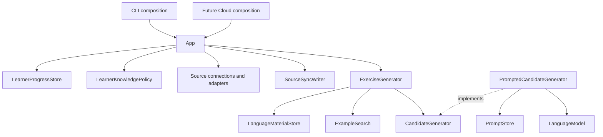

# Yomibu architecture

Accepted direction, including the shared story slice of 2026-10-06. `SPEC.md` defines product requirements and
invariants; this document defines responsibilities, composition, and code
boundaries; `PLAN.md` records delivery and verification. Future examples here
describe intended contracts, not implemented features or authorization to build
every adapter.

## Delivery boundary

The completed migration covers the existing WaniKani `sync` and offline `status`
use cases, an application entry point, and interchangeable file and in-memory
stores. Story preparation uses explicit inventory/request input, on-demand knowledge
policy, and cached lexical retrieval. The single current story path makes one
explicit experimental provider request with independent bounded assessment,
manual/WaniKani inventory projection, multiple
targets, a brief and explicit embedding retrieval, described below. Validated generation, grammar database persistence,
multi-source learner management, PostgreSQL, Cloud HTTP endpoints, and additional
provider integrations follow later.
Keep one Cargo workspace with separate library and CLI packages.

The early manual preview and source-inspection commands are retired; current
story preview/retrieval and eligibility replace their relevant roles.

Do not replace the existing safety behavior during migration: source-state
preservation, full-refresh replacement, account protection, writer exclusion,
schema-1 compatibility, credential isolation, and distinct pre-replacement and
uncertain-durability errors remain required.

## Domain and vocabulary

Use the responsibility definitions in [SPEC.md](SPEC.md#design-vocabulary-and-composition).
The central distinctions are:

- **Language material:** what a character, word, or grammar entry means, including
  readings, descriptions, examples, identifiers, and provenance.
- **Learner progress:** source observations and manual declarations about a
  learner. Retain source state rather than a permanent `known` flag.
- **Learner knowledge:** the result of applying `LearnerKnowledgePolicy` to the
  selected progress. It is derived, explainable, and recomputable.
- **Source connection:** one learner's specific provider account or input. A
  provider kind is not a connection ID, and a provider account ID is not the
  future Yomibu learner ID.
- **Prompt template:** stored reusable instructions. **AI model request:** finalized
  input for one invocation, including the selected exercise data and options.

Grammar entries keep provider-scoped IDs. Bunpro and Renshuu entries are not
automatically declared equivalent. Manual declarations receive technical IDs;
the learner supplies a description, not an ontology identifier. Never infer a
global count of unique grammar rules from unrelated provider records.

Application settings, learner data/source selections, and exercise requests are
separate inputs. Do not reintroduce an all-purpose `ProfileConfiguration`.

## Responsibilities and dependency direction



This diagram is the target responsibility model. The current sync/status slice
uses a physical `LearningStore` with a consistent read and an exclusive
`SourceSyncWriter`; it does not pretend that a WaniKani batch is generic learner
knowledge. Its `LearningSource` supplies normalized `WaniKaniSyncData` for this
slice. Generalize that source contract when a second real integration requires
it; do not erase provider semantics preemptively.

`FileLearningStore` and `InMemoryLearningStore` are physical backends. Their
current coherent read serves offline source summaries and preparation. Later
material/progress read ports can share the same backend and transaction boundary. This is not a
third repository of snapshots: `WaniKaniSyncData` is the transfer value containing
related material and progress from one synchronization interval.

Adapters implement small capabilities owned by the library. `App` depends on
those contracts, not HTTP or filesystem details. Domain validation is synchronous
and independent of adapters. No dependency-injection container, service locator,
per-field service objects, or mutable current-user singleton is needed.

Public extension points are justified by actual substitution needs. Use concrete
values/functions for deterministic logic. Code may be public without making all
its Rust implementation details `pub`. A trait does not require dynamic dispatch;
choose generics or trait objects according to actual composition needs.

## Execution and ownership

The executable owns argument parsing, settings, secret resolution, runtime
startup, output, and exit status. Library code does not read process environment,
start a runtime, or print. Constructors compose/configure; explicit methods open
resources and execute work.

For the current CLI:

1. Parse the command. Resolve a data directory for sync/status; only `sync`
   resolves the WaniKani token. Story preview loads explicit inventory/request/cache files and directly
   calls synchronous library planning without initializing execution resources. Analyze validates
   explicit input, then selects an external dictionary or a managed installation.
   Only managed selection resolves its dictionary directory's HOME default.
2. For sync/status, construct `FileLearningStore` for that directory and `App`.
   For `sync`, supply the WaniKani client as the source. `status` needs no source
   or HTTP client.
3. `App.sync` acquires a store writer before network retrieval. A corrupt cache
   or conflicting writer fails before fetching. The writer lives across fetch
   and replacement and is released on success, error, or future cancellation.
4. The source retrieves and normalizes the complete selected account state.
   Validation and summary preparation occur before commit.
5. The writer publishes material and progress together. The result identifies
   in-memory retention versus acknowledged durable persistence.
6. `App.status` loads a coherent data version and computes an owned summary. It
   never fetches, resolves secrets, or writes. The CLI renders the result.


One current store instance/directory is an explicit account scope. It must not
switch to a different account after its first successful write. This is not yet
a Cloud tenancy model. A future Cloud request authenticates and authorizes its
learner/connection before calling the library; do not infer authorization from
an arbitrary caller-supplied learner ID.

For generation, extend the flow explicitly:

```text
request -> settings and secrets -> dependencies -> optional explicit sync
        -> selected learner progress -> LearnerKnowledgePolicy
        -> language material and examples -> candidates -> validation
        -> accepted result or typed failure
```

`App` can accept all principal dependencies and construct `ExerciseGenerator`
internally. A convenience builder selects a documented default composition;
advanced users can compose the same dependencies directly. The standalone
generator accepts already prepared knowledge and does not require persistence.
Generation neither implicitly synchronizes nor changes learner progress.

Shared clients/pools/stores live as long as the application. A request owns its
learner selection, immutable inputs, budget, and result. Read a coherent input
version and pin prompt-set identity/version for each generation; release database
transactions before awaiting the model. New source data affects later requests.

## Generation structure and extension boundaries

Prioritize the learner's reading experience. Reuse deterministic offline
preparation, constrained candidate construction, checks and narrowly defined
repair where their behavior is supported. Model calls are explicit bounded
contributions; neither offline construction nor a model assertion establishes
linguistic validity. These are future composition choices, not current experimental generation behavior
or a requirement to introduce generator abstractions now.

The following is the target responsibility model, not G0's implementation list:

```text
LearnerKnowledge + GenerationRequest
                -> StoryGenerationPlan
                -> CandidateGenerator
                -> Candidate[]
                -> Analysis + required checks
                -> Combined review when required
                -> Selection
                     -> accepted exercise
                     -> bounded repair -> NEW candidate -> full reassessment
```

Keep `LearnerKnowledge` and `LearnerKnowledgePolicy`; the discussion's
`KnowledgeProfile` and `KnowledgeProfileBuilder` do not introduce parallel
responsibilities. Knowledge about a vocabulary use keeps its written form,
reading, and meaning associated. A provider grammar entry and a recognizer that
can detect it are different facts; unsupported recognition is explicit and does
not imply equivalence across providers.

The logical text and analysis structures are:

```text
Candidate (immutable identity, content, generator provenance)
  GeneratedText
    Sentence -> text
    Story -> optional title + Paragraph[] -> Sentence[] -> text

TextAnalysis (candidate identity, analyzer/dictionary versions)
  ParagraphAnalysis[]
    SentenceAnalysis[]
      tokens + morphology + proposed readings
      grammar matches + complexity measurements
```

These diagrams need not become one public Rust struct per line. Choose enums
where distinct content variants require distinct payloads; introduce dialogue
or poetry variants only with an actual supported use case. Fragments may refer
to ranges in one immutable text representation. Tokens are analysis products,
not authoritative content supplied by a generator. Sentence segmentation and
other derived boundaries must also be attributed to their producer, not treated
as independent linguistic evidence merely because they have a type.

Generate a story as a coherent whole. Apply checks at their meaningful scopes,
including multi-token expressions and whole-story coherence. Titles also need
the applicable learner constraints. Findings carry a candidate reference and an
unambiguous location; token indices additionally identify the relevant analysis.
Document whether ranges use UTF-8 bytes or another unit. Editing creates a new
candidate (optionally linked to its parent), followed initially by full analysis
and assessment. Incremental invalidation is deferred.

Separate execution from judgment. A completed check has pass/fail/inconclusive
and findings; an execution failure remains a typed error, and a skipped check is
reported as not run. Required outcomes gate acceptance; quality measurements
rank eligible candidates. Keep weights and thresholds in explicit selection
configuration. Do not invent calibrated confidence from an arbitrary LLM score.
Measure false acceptance/rejection, unresolved cases, success before repair,
cost/latency, and learner-reported reading friction when evaluating real text.

Group components by concern while using small contracts for roles. For example,
a vocabulary component may contribute generation restrictions, check a candidate,
and propose repair information. An analyzer or candidate generator may implement
only its own role. Ordinary functions suffice for fixed deterministic behavior;
traits need a demonstrated substitution. Avoid a global context/service locator,
optional-hook mega-trait, execution DAG, or plugin manifests.

Trusted extension logic returns typed task contributions or uses explicitly
provided capabilities. The orchestration owns phase execution and the shared
model budget; no independent model calls hide in validators or retries. Prompt
composition consumes typed inputs plus replaceable prompt content and decodes
validated response shapes. This does not require a heterogeneous task registry
or arbitrary schema-merging framework. Role-specific contracts and their exact
Rust ownership/dispatch choices are verified in the implementing slice.

## Retired prototype commands

G0 first-N preview and standalone source-use preparation are retired. Their
original contracts and last Git pin are in [COMMAND HISTORY](docs/COMMAND_HISTORY.md).
Eligibility remains in `knowledge.rs`: `derive(source)` returns ordered decisions
and borrowed source evidence without grammar input. `inventory.rs` uses it for
WaniKani projection; manual inventories supply material explicitly.

## A1 evaluation boundary (complete; no-go)

A1 introduced the synchronous analysis/evaluation reused by current story generation:

- `analysis.rs` owns the bounded borrowed sentence and morphological evidence
  shapes. Whole units and components retain original UTF-8 byte spans.
- `adapters/sudachi.rs` explicitly loads exact verified dictionary bytes and uses
  `adapters/sudachi.json` as embedded configuration. No ambient config, user/dynamic
  plugins, normalization, fallback tokenizer, or implicit download. Owned bytes
  avoid checksum/mmap file races; real adapter tests remain mandatory.
- `evaluation.rs` validates input structure and applies exact synthetic vocabulary
  tuples plus seven explicit grammar bindings. It preserves arbitrary declaration
  content and IDs. Five checks report Pass/Fail/Inconclusive; typed input/execution
  errors remain outside those judgments, and NotRun is a distinct state.
- The retired A1 packet runner remains reproducible at revision
  `d2adfcfe6dffede63363bf1a11be81ce8fe85606`. [A1 evidence](docs/A1_IMPLEMENTATION.md)
  preserves historical inputs/protocols/conclusions. Current story and evaluation
  tests exercise its useful outcome/error/span protections without an unused executable.
- `scripts/setup_a1_dictionary.py` is explicit development/CI setup, outside runtime
  composition. It verifies the publisher ZIP and all three bundle files, retains
  complete bundles under ignored target storage, and publishes a `current` symlink
  atomically after synchronizing the bundle. Post-publication directory-sync errors
  report uncertain durability. Cache reuse verifies a single resolved bundle;
  legacy flat files and earlier bundles remain untouched. Offline Python boundary
  tests exercise setup; Rust tests still require the real pinned adapter at
  `target/a1/current/system_core.dic` and never silently skip or substitute it.

The [binding sheet](docs/A1_BLIND_PACKET_HEADER.md) defines two bounded patterns
and their exact limitations. Components cannot authorize a whole word. Object-use
metadata remains associated with a lexical identity and needs external source
evidence. Dictionary hypotheses and model opinions are not contextual truth.
Every evaluation exposes naturalness, MWE, and reading/sense limitations; a
structural Pass is never an accepted exercise.
Scope is an independent structural coverage/applicability check, not a copy of
permission outcomes; the [reference clarification](docs/A1_SCOPE_CLARIFICATION.md)
records that boundary without changing runtime composition.

Reference review remains a manual evidence process outside runtime. The
[protocol](docs/A1_REFERENCE_PROTOCOL.md), [packet](docs/A1_REVIEW_PACKET.md), and
[external prompt](docs/A1_EXTERNAL_REVIEW_PROMPT.md) keep source coverage,
provisional judgments, analyzer performance, and run integrity separate. The
visible synthetic set has provisional source-backed references and has been
evaluated after the separate custodian's holdout reference freeze. Its challenge
safeguard failed; the [evaluation record](docs/A1_EVALUATION_STATUS.md) keeps that
finding separate from held-out core accuracy. The implementation was frozen
before input release and used unchanged for one offline held-out run; complete
output is preserved. The separate private scoring receipt reports all held-out
core targets met, with one exact-span discrepancy retained. The failed challenge
safeguard makes the completed investigation a no-go; this does not add generation
or acceptance logic to runtime. Neither blind reference labels nor private learner
material belong in analyzer composition, Git, or this implementer's early context.
Versioned public synthetic drafts contain only runtime inputs. Private revision
logs preserve exclusions, family lineage, references and disagreements; changing
a draft does not change the analyzer or erase exposure for holdout separation.
The historical slice preserved source/store, sync/status and schema-1 boundaries.

The separate [post-A1 safeguard](docs/A1_FOLLOWUP.md) changes only the concrete
evaluator's treatment of recognized object/predicate combinations. It borrows the
object noun and particle to retain the combination's original span. Transitive
word evidence still cannot assess a multiword use, so Particles and Scope retain
uncertainty, combined with any existing permission failures. Other bounded checks
remain visible. This restriction also affects ordinary object sentences; there
is no phrase list, semantic adapter, new input format, or acceptance path. The
checkpoint and subsequent commits distinguish this code from the scored A1 run.

## Offline analyze command — separate post-A1 milestone

```text
CLI arguments -> bounded explicit JSON read -> Sentence + GrammarDeclarations
              -> pinned SudachiAnalyzer -> evaluation::evaluate
              -> escaped text or versioned JSON -> execution exit status
```

`crates/yomibu-cli/src/analyze.rs` is a private module of the binary, not a library adapter or a new
domain service. It owns the small version-1 input envelope, 64 KiB bounded file
read, report envelope, and rendering. It reuses `EvaluationBindings` directly;
the library remains the sole authority on bindings and linguistic judgments.
Reports borrow the input and retain the original analysis/evaluation values.
Text includes every check and finding with quoted original byte-span excerpts;
JSON serializes the complete evidence and limitations without interpreting it.
Text and diagnostics use Rust display escaping. JSON keeps Serde's encoding and
additionally escapes DEL and nonprinting Unicode as JSON UTF-16 escapes, retaining
the original decoded strings. At the binary boundary, argument errors escape
Clap's invalid argument/value/subcommand contexts before formatting, preserving
diagnostic line breaks and indentation. The fixed `yomibu` binary name prevents
untrusted executable names from entering usage/help. Help/version keep normal
stdout presentation and successful exit status.
Errors propagate outside completed judgments, and no evaluation is printed when
input, dictionary initialization, analysis, or evaluation fails.

The branch in `main.rs` constructs no learner store, source or runtime. Explicit
`--dictionary` remains the owned, checksum-pinned operation; otherwise managed
selection resolves its directory's HOME default. There is no implicit setup,
ambient analyzer configuration or learner-file discovery. The A1 research harness
is retired; its frozen evidence and reproducible code remain in documentation/Git history.
This CLI does not revise A1's historical no-go or the later object-combination
restriction. Real-adapter subprocess tests compare CLI output to direct library
evaluation and check errors, spans, escaping and absence of writes.

## Managed dictionary composition

`adapters::dictionary` owns explicit offline import, full verification and
selection of one published generation. It checks bounded records, filesystem
ownership/type/permissions and the pinned header/length. `adapters::sudachi`
keeps one storage backend alive and constructs the same JapaneseDictionary with
embedded configuration/character definitions for owned and mapped bytes. Its
`unsafe load_managed` API documents installation verification and lifetime-long
file stability as caller obligations; receipts/checks do not prove immutability.

Binary-private `args::DictionaryArgs`, implemented in `commands/dictionary.rs`,
shares resource selection between analyze and generation after their preflight. Environment
resolution remains executable-only. One analyzer is reused for the command;
analysis/evaluation and candidate assessment have no storage-policy branches.
Both policies can serve future sessions/servers without a new analyzer trait.

Import copies into private staging, verifies the exact destination dictionary
and notices, synchronizes completed storage and atomically switches `current`.
The standard-library writer lock coordinates importers only. Published generations
are retained and never edited in place. Post-publication sync failure is distinct
from pre-publication failure. See [dictionary safety](docs/DICTIONARY.md).

## Shared story composition

Open `crates/yomibu/src/story.rs::plan_generation` and the adjacent `generate_story`
for the shared sequence. The CLI dispatches to `commands::story::generate`, separate
from offline `commands::story::preview` and explicit `commands::retrieval::prepare`. Source differences end at
`load_inventory`; an API supplies the same inventory/request/cache and resources.

```text
manual input / WaniKani cache + policy (+ optional manual supplement)
  -> CLI load_generation_inputs (validate before embedding work)
  -> CLI load_or_prepare_embeddings
  -> library plan_generation
       validate inputs/options/selection bounds
       select_vocabulary (once)
       build_ai_model_request (bounded selection + exact bytes)
       StoryAssessmentInputs::new (full original inventory)
  -> CLI dictionary.load
  -> CLI execute_story_plan (credential, client and Tokio I/O runtime)
       library generate_story
         client.generate_story_candidates (one attempt; unchanged bytes)
         assess_candidates (every original text)
         StoryGenerationResult (owned originals + partial assessments)
  -> CLI output::story::write_generation
  -> CLI require_successful_execution (exit status)
```

`inventory.rs` validates the common data and projects the existing source policy.
The source cache stays untouched. `story.rs` keeps the request, selection,
prepared bytes and assessment stages adjacent. `retrieval.rs` owns encoding,
identity/cache validation, bounded cache preparation and cosine similarity; `ports::Embedder` is the only new
port, implemented by explicit lexical-baseline and local/hosted HTTP adapters.
The HTTP embedding adapter splits each input group by its actual serialized size;
the explicit file-cache adapter owns bounded reads, validation before publication
and atomic replacement;
common embedding-input preparation and public cache preparation share the same
whole-input size preflight before any provider work. There is no model/default selection service or generic pipeline.
`StoryGenerationOptions` currently contains only `candidate_count`, default 2. It is
passed separately to request preparation; brief/targets stay in `StoryRequest`.
CLI `--candidates N` accepts positive integers with checked token-budget arithmetic,
without an arbitrary 4/8 cap. Provider token limits and the 64 KiB response cap
still apply. The prompt/schema/parser require the requested count, output tokens
scale at 512 per candidate, and current results/assessments use vectors/slices.
Retired G1/G2 fixtures are archived outside the test tree. No repair-round
configuration exists until repair is implemented.

`StoryVocabularySelection` borrows selected inventory entries. The complete
`StoryGenerationPlan` privately binds this final subset, immutable `AiModelRequest`
bytes/hash/options and full-inventory `StoryAssessmentInputs`. Planning creates the
structural-check projection once before execution resources. Assessment inputs
borrow the original inventory/request and selected IDs rather than the selection
struct, avoiding a self-referential plan. No full-inventory clone is needed.

`StoryGenerationResult` owns originals/provenance and all available assessments,
including typed candidate errors. `Sentence` uses `Cow<str>`: ordinary analysis
borrows; the result copies only bounded analyzed sentence text and moves the
remaining evidence. This makes a result usable after the inputs/client/analyzer
are dropped. `Sentence` is no longer `Copy`; its text getter borrows `&self`.
Provider failure returns no result; completed Fail/Inconclusive and per-candidate
execution errors remain distinct. The library has no credential lookup, runtime
creation or terminal output. CLI and future API await the same execution function.

Selection is cached cosine ranking with explicit targets first. Preparation may
remove lowest-ranked non-target supports to fit the unchanged byte limit, then
freezes the exact body. Provider transport and settings live in
`adapters/openai.rs`. The `story-inventory-v1` format replaced historical request
formats; this cleanup leaves current bytes/hash unchanged. `generate_story_candidates`
returns `ProviderError` directly, with no generation-error wrapper. `evaluation.rs` reuses the
bounded structural checks, adds a conservative full-inventory lexical check and
bounded grammar observations; it does not reinterpret source alternatives as
verified reading/sense pairs. The grammar observer and structural checker share
the same direct-object evidence predicate, while the historical object-combination
safeguard remains intact.

`reports/story.rs`, `reports/candidate.rs` and `reports/analysis.rs` expose shared
serializable projections of completed results. Candidate error classification and
NotRun checks live here; report conversion performs no assessment. CLI `output/`
adds terminal escaping and text layout without owning the wire schema.
`adapters/input_file.rs` performs bounded reads of explicitly chosen paths; the
CLI selects the input format and decodes JSON. Preview requires cached
vectors and performs no provider/dictionary/runtime initialization. Generation
initializes its dictionary/credentials only after its final request is prepared.
Embedding preparation is separately explicit and may need its own credentials.

See [STORY GENERATION](docs/STORY_GENERATION.md) for contracts and [RETRIEVAL](docs/RETRIEVAL.md)
for backend configuration, cache boundaries and the incomplete dense comparison.
G1/G2 implementations, context selector and focused observation APIs are removed.
`generation.rs` contains only live assessment/error and provider metadata types;
target morphology support stays beside its caller in `story.rs`. Historical
fixtures live under `docs/history/generation/`, with reproducible code pins and
conclusions in [GENERATION HISTORY](docs/GENERATION_HISTORY.md). A1's no-go and
frozen records remain unchanged.

## Stores, source data, and consistency

| Backend | Retention and failures | Verification |
| --- | --- | --- |
| In memory | Lives with its explicit store handle; no crash durability; full replacement and account validation still apply | Real state transitions, failed writes, reader/writer isolation |
| Local file | Complete replacement under an advisory lock; failures before replacement preserve the old cache; directory-sync failure means replacement happened but durability is uncertain | Actual temporary files, interruption and filesystem faults |
| Future SQL | Transactional material/progress publication scoped to learner/connection; database errors and commit uncertainty remain explicit | Isolated real database, transactions and concurrency |
| Future API | Latency, authentication, availability, write support, and consistency depend on the service contract | Real HTTP adapter against a local controlled endpoint |

Do not imply that an in-memory backend verifies file durability or SQL behavior.
Do not silently substitute memory storage after a persistent-store failure.
The current cache remains `wanikani.json` with the schema-1 `snapshot` key; the
Rust type name does not determine its wire format.

Multiple future connections can provide the same material category. Preserve
connection-level progress provenance. Refreshing one connection replaces only
its own data, preserving other connections and manual declarations. Report each
connection's outcome and data age; partial success is not an all-source success.

Separate updates from derived views. `LearnerKnowledge` starts as an on-demand
calculation. A materialized view, if later justified, carries input revisions
and policy version. CQRS does not require event sourcing, a command bus, or a
second database. Generating an exercise is a costly operation even without a
database write; fetching an existing result is a different operation.

## Generation composition examples (future Ruby pseudocode)

One-off use does not need a learner store:

```ruby
knowledge = LearnerKnowledgePolicy.default.derive(progress)
candidates = PromptedCandidateGenerator.new(model: model, prompts: prompts)
generator = ExerciseGenerator.new(
  materials: InMemoryLanguageMaterialStore.new(materials),
  examples: InMemoryExampleSearch.new(examples),
  candidates: candidates
)
result = generator.generate(knowledge, request, budget)
```

Cloud uses public adapter code with private runtime data:

```ruby
store = PostgresLearningStore.new(pool)
prompts = FilePromptStore.new(directory: private_prompt_directory)
candidates = PromptedCandidateGenerator.new(model: model, prompts: prompts)

app = Yomibu::App.new(
  materials: store.materials,
  progress: store.progress,
  sync_writer: store.sync_writer,
  sources: authorized_sources,
  examples: PostgresExampleSearch.new(corpus_pool),
  knowledge_policy: LearnerKnowledgePolicy.default,
  candidates: candidates
)
report = app.sync(authorized_learner) if refresh_requested
result = app.generate(authorized_learner, request, budget)
```

These are composition sketches, not frozen Ruby-like constructor requirements
for Rust. In-memory data does not imply an offline model. Replacing the model or
the corpus adapter must not change generation logic. A thin Cloud client calls
the remote Yomibu use-case API; it does not masquerade as a `LanguageModel`.

## Scenario checks and implementation timing

| Scenario | Composition change | Shared behavior and timing |
| --- | --- | --- |
| Local CLI, remote model | Local data/prompt stores plus a remote `LanguageModel` | Knowledge derivation, context preparation, validation, and budgets remain the same; implement with the first generation slice |
| Local CLI, local model | Replace only the model adapter, with an explicit capability/structured-output contract | Same generation flow; implement a local adapter only when a specific runtime is selected, without pretending all models have identical capabilities |
| Local algorithm, remote corpus | Replace `ExampleSearch` or the needed material read capability with an HTTP adapter | Selection and validation remain local; network failures and deadlines remain explicit; remote corpus is deferred |
| Thin remote Yomibu client | Use a Yomibu use-case client calling the Cloud API | The server owns generation dependencies; this is an alternative execution boundary, not a model swap; remote protocol is deferred |
| One-off in-memory generation | Pass progress/derived knowledge and material values directly; use memory adapters only for required lookup contracts | Same standalone generator without persistence, learner registration, or synchronization; cover with the first generation slice |
| Several sources of one category | Explicit connection IDs and selected progress for each learner; share provider clients where safe | One connection's refresh never overwrites another; policy combines preserved evidence; connection model and merge rules precede implementation of multiple providers |

Adapter substitution preserves the consuming algorithm only when its contract
is met. A read-only remote corpus cannot implement a writable synchronization
store, and volatile storage cannot promise crash durability. Do not hide these
differences behind a uniform success value or automatic fallback.

## Public contracts and evolution

The implemented storage entry points are `App.new(store).status()` and
`App.new(store).with_source(source).sync()`. Manual preview has the separate
current offline story planning entry point. `SyncReport` contains an owned
summary, source synchronization times, and persistence classification. Errors
retain the source/storage type. In particular, a file
`WriteError::DurabilityUncertain` must remain distinguishable through `SyncError`;
the caller can inspect the visible cache instead of blindly retrying retrieval.
No result is persisted by status. Sync may create the directory/lock file before
fetching, but does not replace usable data after a source failure.

The current storage methods are synchronous for memory and local files. Do not
implement remote or asynchronous SQL adapters by blocking inside these methods.
Design their async read/publication capabilities with the actual backend in the
later storage milestone. The library is unpublished and its Rust API is not yet
stable; preserve schema-1 disk compatibility independently of source API changes.
There is no frozen generic source ontology or promise of drop-in asynchronous
storage for this first slice.

Future validated-generation results must identify the accepted exercise, validation
outcome, policy/input/prompt revisions, and consumed attempts/model usage when
known. Distinguish invalid constraints, unavailable context, rejected candidates,
model/transport failure, deadline/cancellation, and exhausted budget. Successful
generation does not imply saving a result or modifying learner progress.
Avoid automatic retries after uncertain model completion; Cloud idempotency and
explicit result persistence need their own documented contract.

## Files, packages, and repositories

The current implementation slice is organized by responsibility:

```text
Cargo.toml                   workspace, shared versions and test profile
Cargo.lock                   one pinned dependency graph
crates/
  yomibu/
    Cargo.toml               library dependencies; no CLI dependency
    src/
      lib.rs                 public entry points
      inventory.rs           common manual/WaniKani inventory and validation
      story.rs               shared planning/execution and adjacent concrete stages
      retrieval.rs           embedding inputs/cache and cosine ranking
      generation.rs          candidate assessment/errors and provider metadata
      reports/               serializable story/candidate/analysis projections
      app.rs                 sync/status orchestration
      domain.rs              source data and invariants
      summary.rs             source summaries
      grammar.rs             manual familiarity declarations
      knowledge.rs           source eligibility policy
      analysis.rs            original C/A morphological evidence
      evaluation.rs          bounded checks and executable bindings
      ports.rs               source/storage/embedding capabilities
      adapters/
        mod.rs
        dictionary.rs        verified managed dictionary publication
        dictionary/tests.rs  publication/failure boundary tests
        sudachi.rs           real checksum-pinned analyzer
        sudachi.json         embedded analyzer configuration
        openai.rs            one bounded Responses attempt
        openai_tests.rs      socket deadline/body-bound tests
        embeddings.rs        local/hosted encoders and lexical baseline
        embedding_cache_file.rs bounded reads and atomic cache publication
        input_file.rs        bounded explicit-path input reads
        sources/wanikani/    HTTP source, DTOs and boundary tests
        stores/              file and in-memory storage adapters
    tests/                   library use-case and adapter contracts
  yomibu-cli/
    Cargo.toml               depends on yomibu; binary name remains yomibu
    src/
      main.rs                parse, startup and exit status
      args.rs                Clap arguments only
      commands/
        mod.rs               command dispatch
        story.rs             generation/preview files and execution resources
        retrieval.rs         encoder/credentials/runtime and cache adapter calls
        input.rs             input formats, inventory source selection and secrets
        analyze.rs           explicit analysis input and dictionary composition
        dictionary.rs        dictionary selection/import/verification
        sync.rs              unchanged sync/status environment and resources
      output/
        mod.rs               safe JSON, diagnostics and shared check rendering
        story.rs             story/preview terminal layout
        candidate.rs         candidate/provenance terminal layout
        analysis.rs          analysis terminal layout
        dictionary.rs        dictionary loading provenance layout
        status.rs            source summary terminal layout
      story_tests.rs         executable/report integration test harness
    tests/                   CLI and combined library/executable contracts
tests/fixtures/              shared immutable synthetic inputs and snapshots
scripts/                     dictionary setup and explicit retrieval probe
target/a1/current/           ignored real pinned dictionary bundle
docs/                        current usage and historical evidence
ARCHITECTURE.md              composition and repository boundaries
SPEC.md                      product contracts
PLAN.md                      delivery and verification evidence
```

As working functionality arrives, split `domain.rs` into `domain/learner.rs`,
`materials.rs`, `progress.rs`, and `exercise.rs`; add `knowledge/` and
`generation/` when the implemented scope outgrows the concrete story module.
Group future model adapters in `adapters/models/`, prompt adapters in
`adapters/prompts/`, and corpus adapters in `adapters/examples/`. WaniKani stays
under `adapters/sources/wanikani`; Bunpro joins that category when implemented.
Create files for cohesive responsibilities, not one file for each field/type.

Keep code in one public GitHub repository. The workspace contains the existing
library and CLI only; `yomibu-api` will join it when HTTP behavior is implemented.
CLI owns argument parsing, file/credential selection, runtime creation, rendering
and exit status. Library callers still supply explicit inputs/resources and their
own runtime. The workspace move preserved contracts; the later shared-workflow
Rust API changes are listed above. No API skeleton or generic engine object exists.

Root Cargo commands select both workspace members. The CLI binary has `doc = false`
to keep public Rustdoc at `target/doc/yomibu` without a same-name output collision. `cargo run -- …` selects the
single CLI binary; `cargo run --example …` selects the library example. Package
selection is explicit when useful: `-p yomibu` for library checks and
`-p yomibu-cli` for CLI checks. Test fixtures and dictionary setup remain rooted
in the repository. Member manifests inherit shared versions; only the CLI has
Clap/anyhow dependencies; the library no longer needs them even for examples.
Do not split packages merely to mirror every module.
Private prompt sets and corpora can live in a private asset repository or store
with separate access/deployment; their generic readers need not be private.

Public basics remain available. Future proprietary prompt variants should stay
private from creation, because prior publication cannot be undone by deleting a
file. Credentials and learner data are never repository assets. Public/private
visibility does not replace licensing: provider content retains its provenance
and access restrictions. WaniKani commercial content use requires separate
resolution before Cloud launch; API access is not an open content license.
See the [API content restrictions](https://docs.api.wanikani.com/20170710/#respecting-subscription-restrictions)
and [terms](https://www.wanikani.com/terms), reviewed on 2026-09-30.

## Testing and operational contracts

Use strict Red–Green–Refactor for new behavior. Exercise real domain and
application code with in-memory inputs; substitute only the external behavior
needed by a test. Scripted model responses are test support, not a production
fallback or evidence of linguistic quality. Keep real HTTP/file tests and later
real SQL tests. Share contract cases for common invariants, and retain separate
backend tests for different durability and failure semantics.

No universal `create_null()`, mock framework, or runtime test flag is required.
Check observable outcomes and important effects: cost limits, credential
boundaries, account isolation, and persistence. Internal method-call sequences
are not the public contract.

Document deadlines, cancellation, retries, partial outcomes, data age, and
commit uncertainty. Existing WaniKani request limits remain; a total refresh
deadline/collection bound is still a separate unresolved enhancement. Never
automatically repeat a costly model request whose completion is uncertain.
Generation must retain typed validation failures and must not silently weaken
constraints. Diagnostics identify operations and versions without leaking tokens,
private prompts, or learner content.
